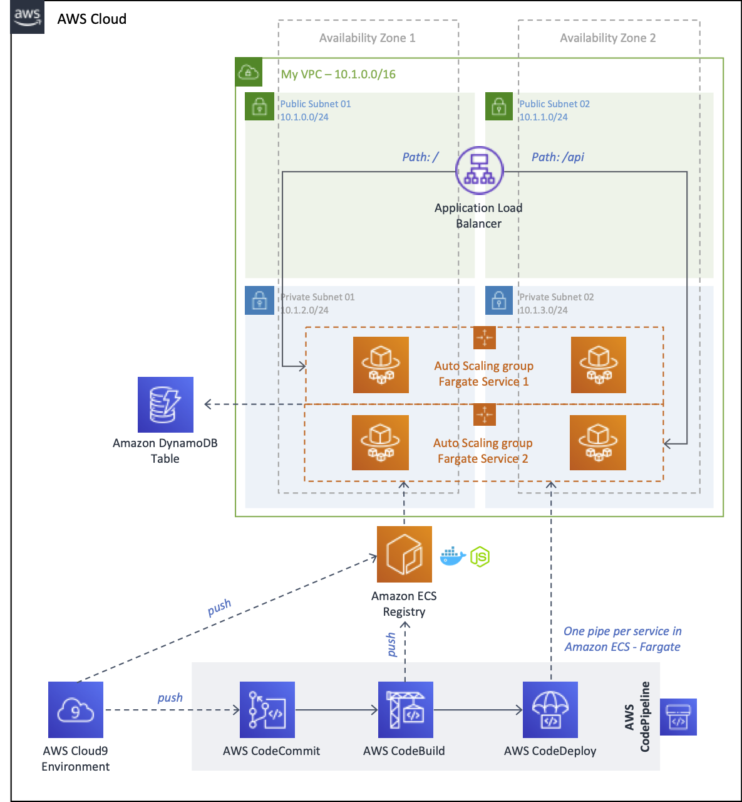

# ECS with two Fargate services using Spot

This repository contains the CDK project as a reference two deploy two services in Amazon Container Service using Fargate and Fargate Spot.



## Requirements for development environment

Work inside your AWS Cloud9 environment - [Create an EC2 Environment](https://docs.aws.amazon.com/cloud9/latest/user-guide/create-environment-main.html#create-environment-console)


Install the latest version of CDK.

``` bash
npm install -g aws-cdk --force
```

Install the Amazon ECS CLI, will be used to push the image docker to an Amazon ECR repository with the ecs-cli push command.

``` bash
sudo curl -o /usr/local/bin/ecs-cli https://amazon-ecs-cli.s3.amazonaws.com/ecs-cli-linux-amd64-latest
sudo chmod +x /usr/local/bin/ecs-cli
ecs-cli --version
```

Install OpenJDK 8.

``` bash
sudo yum -y install java-1.8.0-openjdk-devel
```

Switch or upgrade the default Java development toolset to OpenJDK 8.

``` bash
sudo update-alternatives --config java
sudo update-alternatives --config javac
```

For CodeCommit configuration, your AWS Cloud9 development environment already have IAM credentiales configured, use these credentials with the AWS CLI credential helper. Enable the credential helper by running the following two commands in the terminal of your Cloud9 environment.

``` bash
git config --global credential.helper '!aws codecommit credential-helper $@'
git config --global credential.UseHttpPath true
```

## Create the image containers for each service and push to Amazon ECR

Create a **demo** project only with Java 8 and "Spring Web" dependency. https://start.spring.io/

Modify the main Java application for demo (API: /)

``` java
package com.example.demo;

import org.springframework.beans.factory.annotation.Value;
import org.springframework.boot.SpringApplication;
import org.springframework.boot.autoconfigure.SpringBootApplication;
import org.springframework.web.bind.annotation.GetMapping;
import org.springframework.web.bind.annotation.RestController;

@SpringBootApplication
public class DemoApplication {
	
  @Value("${TARGET:World}")
  String target;

  @RestController
  class HelloworldController {
    @GetMapping("/")
    String hello() {
      System.out.println("Request...");
      return "Hello " + target + "!";
    }
  }

	public static void main(String[] args) {
		SpringApplication.run(DemoApplication.class, args);
	}

}
```

Build your application.

``` bash
./mvnw package
```

Create a **Dockerfile** inside the project with the following content.

``` docker
FROM openjdk:8-jdk-alpine
COPY target/demo-0.0.1-SNAPSHOT.jar app.jar
ENTRYPOINT ["java","-jar","/app.jar"]
```

Build the docker image.

``` bash
docker build -t workshop-api-1 .
```

Push the image to Amazon Elastic Container Registry. **Before you need to have the repositories created by the CDK project.**

``` bash
ecs-cli push workshop-api-1
```
Create a **buildspec.yml** file as follows modifying the **REPOSITORY_URI** and **CONTAINER_NAME** with you own values.

``` yaml
version: 0.2
phases:
  install:
    runtime-versions:
      docker: 18
      java: openjdk8
    commands:
      - docker --version
      # Upgrade AWS CLI to the latest version
      - pip install --upgrade awscli
      - aws --version
      - java -version
  pre_build:
    commands:
      # Discover and run unit tests in the 'tests' directory
      - $(aws ecr get-login --no-include-email --region $AWS_DEFAULT_REGION)
      - REPOSITORY_URI=000000846002.dkr.ecr.us-west-2.amazonaws.com/workshop-api-1
      - CONTAINER_NAME=workshop-api-1
      - COMMIT_HASH=$(echo $CODEBUILD_RESOLVED_SOURCE_VERSION | cut -c 1-7)
      - IMAGE_TAG=${COMMIT_HASH:=latest}
  build:
    commands:
      # Build
      - ls -la
      - mvn package -DskipTests
      - docker build -t $REPOSITORY_URI:latest .
      - docker tag $REPOSITORY_URI:latest $REPOSITORY_URI:$IMAGE_TAG
  post_build:
    commands:
      # Post Build
      - docker push $REPOSITORY_URI:latest
      - docker push $REPOSITORY_URI:$IMAGE_TAG
      - echo Write the image definitions file for ECS
      - printf '[{"name":"%s","imageUri":"%s"}]' $CONTAINER_NAME $REPOSITORY_URI:$IMAGE_TAG > imagedefinitions.json
      - cat imagedefinitions.json
artifacts:
  files: imagedefinitions.json
```

Push the project to your CodeCommit repository.

Repeat the steps above the second service changing the service path and name services.

## Update ECS cluster capacity provider to take advantage of Spot

``` bash
# update your existing cluster with capacity providers support
CLUSTER_NAME=fargate
SERVICE1_NAME=service1
SERVICE2_NAME=service2
FARGATE_WEIGHT=1
FARGATE_SPOT_WEIGHT=1
FARGATE_BASE=1
FARGATE_SPOT_BASE=0

# update the existing cluster
aws ecs put-cluster-capacity-providers --cluster ${CLUSTER_NAME}  \
--capacity-providers FARGATE FARGATE_SPOT \
--default-capacity-provider-strategy capacityProvider=FARGATE_SPOT,weight=${FARGATE_SPOT_WEIGHT},base=${FARGATE_SPOT_BASE} \
capacityProvider=FARGATE,weight=${FARGATE_WEIGHT},base=${FARGATE_BASE}

# update existing service 1
aws ecs update-service --cluster ${CLUSTER_NAME} --service ${SERVICE1_NAME} \
--capacity-provider-strategy capacityProvider=FARGATE_SPOT,weight=${FARGATE_SPOT_WEIGHT},base=${FARGATE_SPOT_BASE} \
capacityProvider=FARGATE,weight=${FARGATE_WEIGHT},base=${FARGATE_BASE} --force-new-deployment

# update existing service 2
aws ecs update-service --cluster ${CLUSTER_NAME} --service ${SERVICE2_NAME} \
--capacity-provider-strategy capacityProvider=FARGATE_SPOT,weight=${FARGATE_SPOT_WEIGHT},base=${FARGATE_SPOT_BASE} \
capacityProvider=FARGATE,weight=${FARGATE_WEIGHT},base=${FARGATE_BASE} --force-new-deployment

# describe the service1 to see its capacityProviderStrategy
aws ecs describe-services --cluster ${CLUSTER_NAME} --service ${SERVICE1_NAME} --query 'services[0].capacityProviderStrategy'

# describe the service2 to see its capacityProviderStrategy
aws ecs describe-services --cluster ${CLUSTER_NAME} --service ${SERVICE2_NAME} --query 'services[0].capacityProviderStrategy'
```